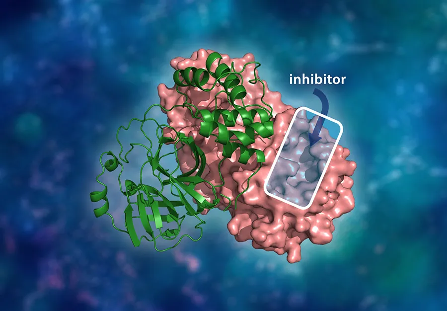

# Protease-Inhibitors-Bioactivity-Prediction

 
### Project Description

#### 1. Data Collection
The initial phase of the project involved gathering data from the ChEMBL database, focusing on "Proteases," a key enzyme group with critical roles in various biological processes, including those related to diseases like coronavirus. Proteases are significant therapeutic targets in drug discovery. The collected data serves as the foundation for further analysis and modeling.

---

#### 2. Data Preprocessing
After data collection, the dataset underwent rigorous preprocessing to ensure it was clean and ready for analysis. This step included:

- Cleaning the data by handling missing values and inconsistencies.
- Transforming and standardizing data into a structured format.
- Preparing the dataset for machine learning by organizing features appropriately.

---

#### 3. Exploratory Data Analysis (EDA) and Visualization
Exploratory Data Analysis was performed to uncover patterns and trends within the dataset. This phase included:

- Visualizing data distributions and correlations to identify important relationships.
- Using graphs and plots to understand the behavior of key features and their impact on the target variables.
- Tools like static and interactive visualizations were used to enhance understanding.

---

#### 4. Feature Selection
Feature selection was a critical step to ensure that the most relevant and predictive attributes of the dataset were utilized. This process involved:

- Identifying and retaining significant features.
- Removing redundant or irrelevant attributes to optimize model performance.
- Ensuring a streamlined dataset for the modeling phase.

---

#### 5. Modeling and Evaluation
Machine learning models were developed and evaluated to predict outcomes based on the selected features. Key steps in this phase included:

- Using multiple machine learning algorithms (e.g., Ridge Regression, Random Forest Regressor, Support Vector Regression, etc.) to build predictive models.
- Comparing model performance based on metrics like Mean Absolute Error (MAE), Mean Squared Error (MSE), and R-squared (R²).
- Selecting the best-performing model to ensure reliable predictions and insights.
